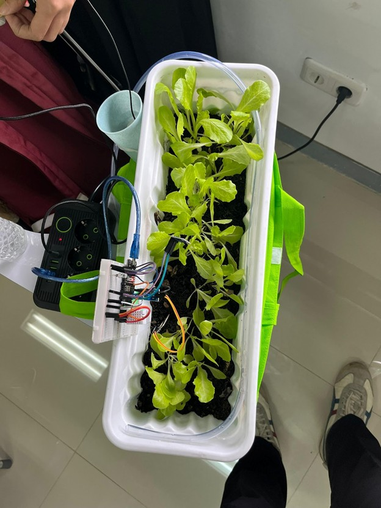

# Smart Farming

This repository contains code for a smart farming project that utilizes various technologies to monitor and manage agricultural activities.

# Architecture

The architecture of the smart farming system is designed to integrate multiple components for efficient data collection, processing, and visualization. The main components include:

- **IoT Devices**: Sensors and actuators deployed in the field to collect data on soil moisture, temperature, humidity, etc.
- **Data Processing**: A backend system that processes the data collected from IoT devices, performs analytics, and stores the results.
- **Frontend Dashboard**: A web-based interface that visualizes the data and allows users to interact with the system using Grafana.


# Technologies Used

- **IoT**: ESP32 Board, DHT, Light, Soil moisture.
- **Backend**: Python
- **Database**: InfluxDB
- **Visualization**: Grafana
- **Deployment**: Docker

# Getting Started

To get started with the smart farming project, follow these steps:

1.  **Clone the Repository**:
    ```bash
    git clone
    ```
2.  **Set Up the Environment**:

    - Install Docker and Docker Compose.
    - Create a `.env` file in the root directory with the necessary environment variables.

    ```
    # MQTT Broker
    MQTT_PORT=1883
    MQTT_WS_PORT=9001
    MQTT_BROKER = "broker.emqx.io"
    MQTT_TOPIC = "esp32/smartfarming/sensor"

    # InfluxDB Config
    INFLUXDB_PORT=8086
    INFLUXDB_BUCKET=mybucket
    INFLUXDB_ORG=myorg
    INFLUXDB_USERNAME=
    INFLUXDB_PASSWORD=
    INFLUXDB_TOKEN=

    ```

3.  **Build and Run the Docker Containers**:

    ```bash
    docker-compose up --build
    ```

4.  **Run the IoT Device Code**:
    - Upload the ESP32 code to your device. Ensure that the device is connected to the same network as your Docker containers.
    - The ESP32 will publish sensor data to the MQTT broker.
5.  **Configure InfluxDB**:
    - Access the InfluxDB UI at `http://localhost:8086` and create
      a bucket with the name specified in your `.env` file.
    - Generate a INFLUXDB_TOKEN
    - Set up the InfluxDB connection in your application using the token and other credentials from the `.env` file.
6.  **Configure Grafana**:
    - Access the Grafana UI at `http://localhost:3000`.
    - Add InfluxDB as a data source using the credentials from your `.env` file.
    - Import the provided Grafana dashboard JSON file to visualize the data.
7.  **Access the Dashboard**:
    - Open your web browser and navigate to `http://localhost:3000` to access
      the Grafana dashboard.

# Images




